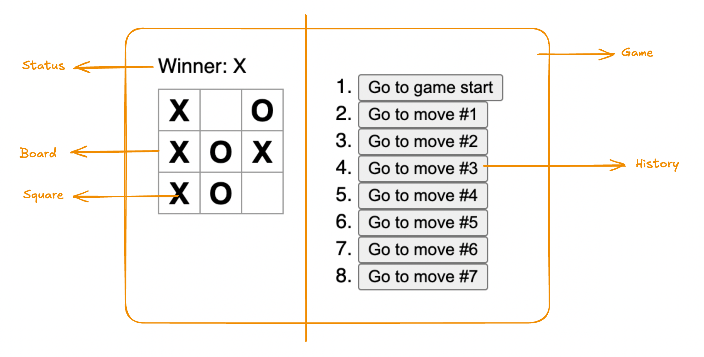

This project has been created using Vite.

1. To scaffold a react project with vite: ```yarn create vite```. For details: https://vite.dev/guide/#scaffolding-your-first-vite-project
2. Now, we want to add tailwindcss to our project. Previously we needed to install autoprefixer, postcss etc. with tailwind for this purpose. Now, we have nice vite support which ease up the tailwind installation.
  - ```yarn add tailwindcss @tailwindcss/vite```
  - Update vite config file
  - Add `@import "tailwindcss";` this line to index.css

For details: https://tailwindcss.com/docs/installation/using-vite

